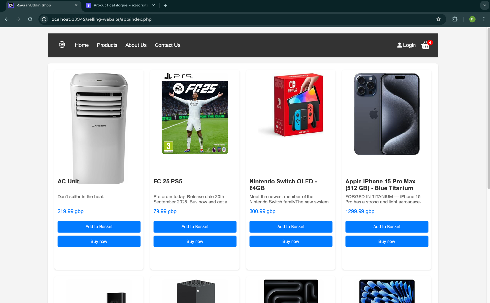

# Ecommerce Website with Stripe API (PHP)

This is a simple Ecommerce website with Strip API integration. This project is created using PHP, MySQL, HTML, CSS, and JavaScript. This project is a simple Ecommerce website where users can buy products and pay for them using Strip API.

## Features
1. **Users.** Allows users to register, login, and manage their accounts. Accounts are used to hold their customer id of stripe, allowing basket items to be saved to their account.
2. **Products.** Allows users to view products, add products to their basket, and remove products from their basket. Products are created via the stripe dashboard.
3. **Basket.** Allows users to view their basket, remove items from their basket, and pay for their basket using the stripe API.
4. **Payments.** Allows users to pay for their basket using the stripe API. Payments are processed using the stripe API.
5. **Orders.** Allows users to view their orders and order details. Orders are created when a user pays for their basket. Used Stripe API to view orders.

## Requirements
1. **PHP.** PHP 7.4 or higher.
2. **MySQL.** MySQL 5.7 or higher.
3. **Stripe API.** Stripe API account.

## Installation
1. **Clone the repository.**
2. **Create a database.**
    ```sql
   SET SQL_MODE = "NO_AUTO_VALUE_ON_ZERO";
    START TRANSACTION;
    SET time_zone = "+00:00";
    
    CREATE TABLE `users` (
    `id` int(11) NOT NULL,
    `fname` varchar(255) NOT NULL,
    `email` varchar(255) NOT NULL,
    `password` varchar(255) NOT NULL,
    `lname` varchar(255) NOT NULL,
    `customerId` varchar(255) DEFAULT NULL,
    `permission` int(11) DEFAULT '0',
    `allowJunkMail` tinyint(1) DEFAULT '0',
    `verify` tinyint(1) DEFAULT '0'
    ) ENGINE=InnoDB DEFAULT CHARSET=latin1;
    
    CREATE TABLE `verification_codes` (
    `userId` int(11) NOT NULL,
    `created` datetime NOT NULL DEFAULT CURRENT_TIMESTAMP,
    `code` int(11) NOT NULL COMMENT 'code'
    ) ENGINE=InnoDB DEFAULT CHARSET=utf8;
    
    
    ALTER TABLE `users`
    ADD PRIMARY KEY (`id`);
    ALTER TABLE `users`
    MODIFY `id` int(11) NOT NULL AUTO_INCREMENT, AUTO_INCREMENT=13;
    COMMIT;
    ```
3. **Update the database connection.**
4. **Create a stripe account.**
5. **Update the stripe API keys.**
6. **Run the application.**
7. **Create products in the stripe dashboard.**

## Preview
View the website [live.](https://selling-website.rayaanuddin.co.uk/)
